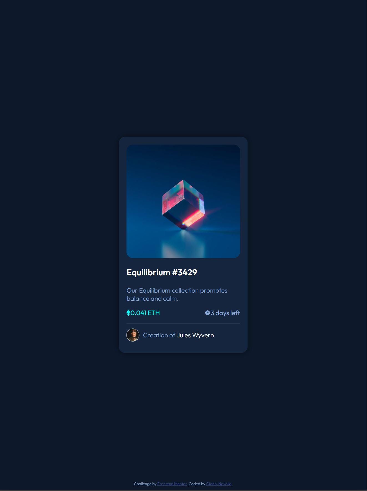
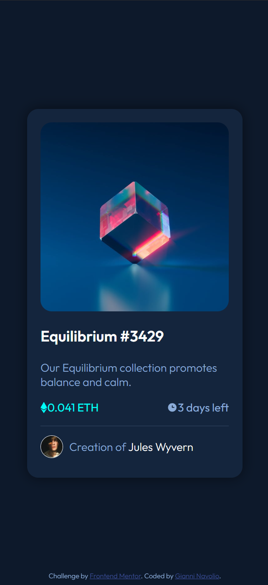

# NFT Preview Card

Solution for a Frontend Mentor challenge.

## 🔗 Links

- **Live Site URL:** [https://gnavolio.github.io/frontend-mentor-challenges/nft-preview-card](https://gnavolio.github.io/frontend-mentor-challenges/NFT-preview-card)
- **Challenge URL:** [https://www.frontendmentor.io/challenges/nft-preview-card-component-SbdUL_w0U](https://www.frontendmentor.io/challenges/nft-preview-card-component-SbdUL_w0U)

## 🧰 Built with

- Semantic HTML5 markup  
- CSS custom properties (variables)  
- Flexbox  
- Positioning and layering with `relative` / `absolute`  
- Responsive design with media queries  

## ✨ Screenshot
- ### Desktop

- ### Tablet

- ### Smartphone

## 🧠 What I learned

> In this project, I built an interactive **NFT preview card component** using HTML and CSS.  
> I practiced working with **positioned elements** to create an overlay effect — showing an eye icon centered on the image when hovering.  
> I also improved my understanding of **CSS variables**, **box shadows**, and **opacity transitions** to create a modern, interactive UI.  
> This challenge helped me solidify concepts like **flexbox centering**, **hover effects**, and **responsive layouts**.  
>  
> Additionally, I learned how to use `inset: 0` and `overflow: hidden` together for a clean and contained overlay animation within rounded borders.

