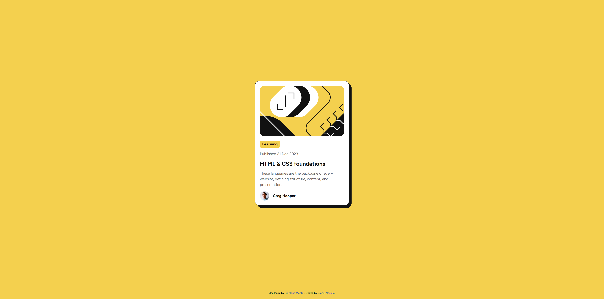

# Blog Preview Card

Solution for a Frontend Mentor challenge.

## 🔗 Links

- **Live Site URL:** [https://gnavolio.github.io/frontend-mentor-challenges/blog-preview-card](https://gnavolio.github.io/frontend-mentor-challenges/blog-preview-card)
- **Challenge URL:** [https://www.frontendmentor.io/challenges/blog-preview-card-ckPaj01IcS](https://www.frontendmentor.io/challenges/blog-preview-card-ckPaj01IcS)

## 🧰 Built with

- Semantic HTML5
- CSS custom properties
- Flexbox / Grid
- Responsive design

## ✨ Screenshot

## 🧠 What I learned

> In this project, I practiced creating a clean and responsive **blog preview card** using HTML and CSS.  
> I improved my understanding of **CSS variables**, **box shadows**, and **border radius** to achieve a polished, modern design.  
> I also learned how to **vertically center content** using Flexbox and how to use the **Figtree** font from Google Fonts for a consistent, professional look.  
> This challenge helped reinforce concepts like visual hierarchy, spacing, and accessibility with proper `alt` text and semantic structure.
