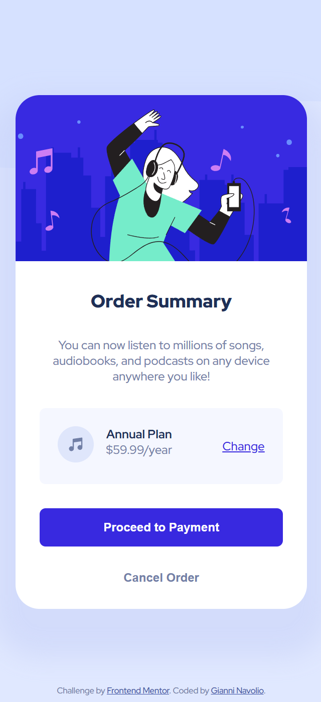

# Order Summary Card

Solution for a Frontend Mentor challenge.

## 🔗 Links

- **Live Site URL:** [https://gnavolio.github.io/frontend-mentor-challenges/order-summary-card](https://gnavolio.github.io/frontend-mentor-challenges/order-summary-card)  
- **Challenge URL:** [https://www.frontendmentor.io/challenges/order-summary-component-QlPmajDUj](https://www.frontendmentor.io/challenges/order-summary-component-QlPmajDUj)

## 🧰 Built with

- Semantic **HTML5** markup  
- **CSS custom properties** (variables)  
- **Flexbox** for layout alignment  
- **Responsive design** using media queries  
- **Modern viewport units** (`lvh`)  
- Reusable **utility classes** for typography and color  

## ✨ Screenshot

- ### Desktop  
  

- ### Tablet  
  

- ### Smartphone  
  

## 🧠 What I learned

> In this project, I recreated a clean and responsive **Order Summary Card** using HTML and CSS.  
> I practiced working with **flexbox alignment** to distribute elements horizontally and vertically inside the card.  
> I also learned how to use **inline-flex** to align icons and text within a single component and applied **CSS variables** for consistent theming.  
>  
> Additionally, I experimented with **modern viewport units** (`lvh`) to handle full-height layouts more reliably across devices, and refined hover effects for interactive elements such as buttons and links.  
>  
> This challenge helped me strengthen my understanding of **component-based CSS structure**, **responsive typography**, and **visual hierarchy** in small UI components.
