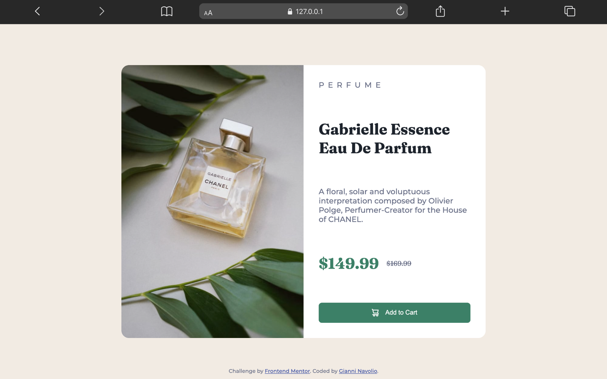
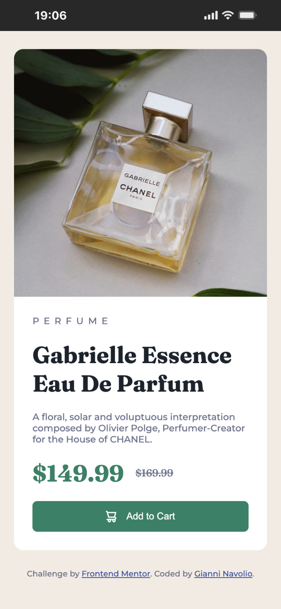

# Product Preview Card Component

Solution for a Frontend Mentor challenge.

## 🔗 Links

- **Live Site URL:** [https://gnavolio.github.io/frontend-mentor-challenges/product-preview-card-component](https://gnavolio.github.io/frontend-mentor-challenges/product-preview-card-component)  
- **Challenge URL:** [https://www.frontendmentor.io/challenges/product-preview-card-component-GO7UmttRfa](https://www.frontendmentor.io/challenges/product-preview-card-component-GO7UmttRfa)

## 🧰 Built with

- Semantic HTML5  
- CSS custom properties  
- Flexbox layout  
- Responsive design with media queries  
- Google Fonts (Fraunces, Montserrat)  
- `<picture>` element for responsive images

## ✨ Screenshot

## 🧠 What I learned

> In this project, I practiced creating a **product preview card** that adapts to different screen sizes.  
> I learned how to use **Flexbox** to split layout evenly between image and content, and how to make images responsive using the `<picture>` element and `object-fit: cover`.  
> I also applied **CSS variables** for consistent typography and colors, and experimented with **letter-spacing**, **text-transform**, and **button styling** for an elegant UI.  
> This challenge helped me reinforce concepts of **responsive design**, **semantic HTML**, **component-based layout**, and **modern CSS techniques** for real-world frontend development.
