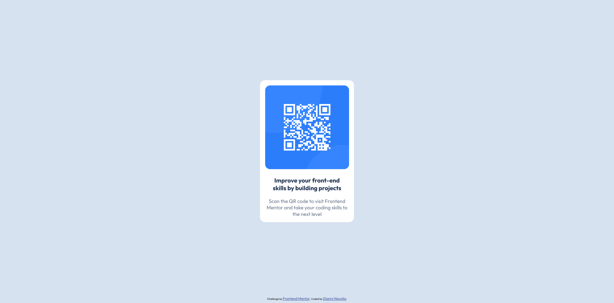

# QR Code Component

Solution for a Frontend Mentor challenge.

## 🔗 Links

- **Live Site URL:** [https://gnavolio.github.io/frontend-mentor-challenges/qr-code-component](https://gnavolio.github.io/frontend-mentor-challenges/qr-code-component)  
- **Challenge URL:** [https://www.frontendmentor.io/challenges/qr-code-component-iux_sIO_H](https://www.frontendmentor.io/challenges/qr-code-component-iux_sIO_H)

## 🧰 Built with

- Semantic HTML5  
- CSS custom properties  
- Flexbox  
- Responsive design  
- Google Fonts (Outfit)

## ✨ Screenshot

## 🧠 What I learned

> In this project, I practiced building a simple and elegant **QR code component** using only HTML and CSS.  
> I learned how to **center content vertically and horizontally** with Flexbox, how to use **CSS variables** for colors and typography consistency, and how to apply **border-radius** for smooth rounded corners.  
> I also refined my use of **semantic HTML** and **accessible alt text**, keeping the layout minimal, clean, and visually balanced.  
> This challenge helped reinforce key front-end principles like **component design**, **visual hierarchy**, and **responsive scaling**.
