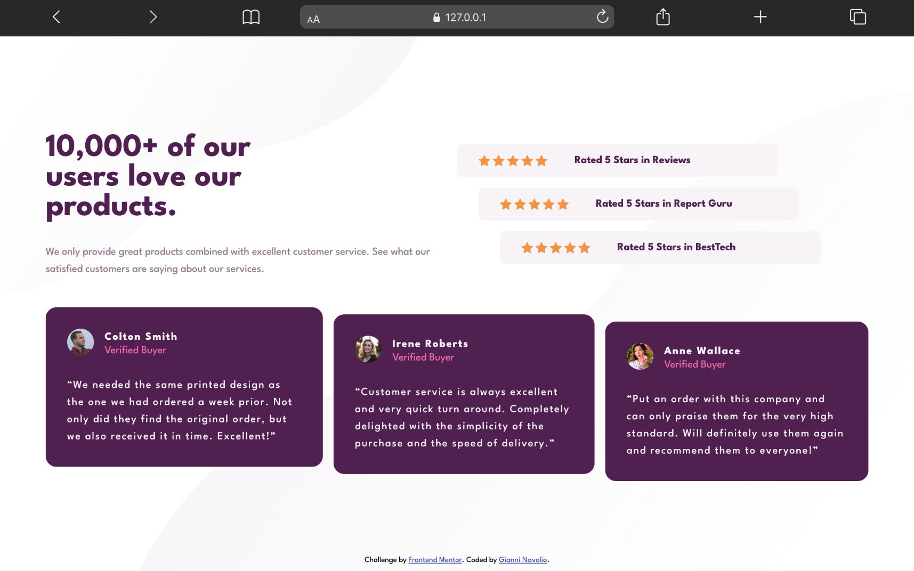

# Social Proof Section

Solution for a Frontend Mentor challenge.

## 🔗 Links

- **Live Site URL:** [https://gnavolio.github.io/frontend-mentor-challenges/social-proof-section](https://gnavolio.github.io/frontend-mentor-challenges/social-proof-section)  
- **Challenge URL:** [https://www.frontendmentor.io/challenges/social-proof-section-6e0qTv_bA](https://www.frontendmentor.io/challenges/social-proof-section-6e0qTv_bA)

## 🧰 Built with

- Semantic HTML5  
- CSS custom properties  
- Flexbox & CSS Grid layout  
- Responsive design with media queries  
- Google Fonts (League Spartan)  
- `<picture>` element for responsive background patterns  
- Subtle transform effects for “stepped” layout

## ✨ Screenshot

## 🧠 What I learned

> In this challenge, I recreated a **social proof section** showing customer reviews and rating cards.  
> I practiced combining **Grid** and **Flexbox** to manage a clean and responsive layout, while adding small **translate()** transforms to create a subtle “staggered” visual effect.  
> I also used **CSS variables** for color and typography consistency and learned to manage different assets for mobile and desktop using the `<picture>` element.  
> This project helped me improve my **layout composition**, **responsive thinking**, and attention to visual hierarchy in UI design.
